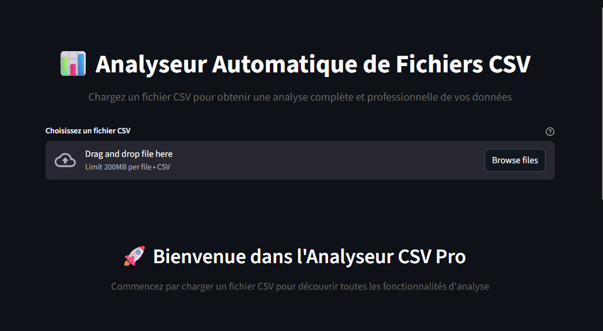

[](https://streamlit.io/)
[](https://python.org)
[](https://pandas.pydata.org)
[](https://matplotlib.org)
[](https://opensource.org/licenses/MIT)

# 📊 Analyseur CSV Pro

**Analysez vos données CSV de manière professionnelle avec des statistiques complètes, des visualisations avancées et des outils de nettoyage automatiques.**

---

## 🎯 Vue d'ensemble

Analyseur CSV Pro est une application web interactive construite avec **Streamlit** qui vous permet d'explorer, d'analyser et de nettoyer vos données CSV sans écrire une seule ligne de code.

### ✨ Caractéristiques principales

- 📊 **Analyse statistique complète** : statistiques descriptives, corrélations, détection d'outliers
- 🔍 **Exploration interactive** : filtres dynamiques, recherche full-text
- 📈 **Visualisations avancées** : histogrammes, boxplots, heatmaps, graphiques catégorielles
- 🧹 **Nettoyage intelligent** : suppression de lignes, imputation, normalisation
- 📥 **Export multi-format** : CSV, JSON, Excel
- 📄 **Rapports détaillés** : rapports Markdown complets avec toutes les analyses

---

## Tester l'app
Cliquez sur "Open in Streamlit" ou utilisez le lien : https://simplecsvanalyser.streamlit.app



---

## 🚀 Installation

### Prérequis

- Python 3.8+
- pip (gestionnaire de paquets Python)

### Étapes d'installation

#### 1. Clonez le repository (ou téléchargez les fichiers)

```bash
git clone https://github.com/SpiritGitHub/csv_analyser.git
cd csv_analyser
```

#### 2. Créez un environnement virtuel

```bash
python -m venv env
```

#### 3. Activez l'environnement virtuel

**Windows :**
```bash
env\Scripts\activate
```

**macOS/Linux :**
```bash
source env/bin/activate
```

#### 4. Installez les dépendances

```bash
pip install -r requirements.txt
```

### Fichier `requirements.txt`

```txt
streamlit==1.28.1
pandas==2.1.3
numpy==1.24.3
matplotlib==3.8.2
seaborn==0.13.0
openpyxl==3.11.0
```

---

## 💻 Utilisation

### Démarrer l'application

```bash
streamlit run app.py
```

L'application s'ouvrira automatiquement dans votre navigateur à `http://localhost:8501`

### Guide rapide

1. 📤 **Chargez un fichier CSV** via l'interface
2. 👀 **Explorez vos données** dans l'onglet "Aperçu"
3. 📊 **Analysez les statistiques** dans l'onglet "Analyse"
4. 📈 **Visualisez les patterns** dans l'onglet "Vizs"
5. 🧹 **Nettoyez les données** dans l'onglet "Nettoyage"
6. 📥 **Exportez** vos données traitées
7. 📄 **Générez un rapport** complet

---

## 📋 Fonctionnalités détaillées

### 🔍 Onglet Aperçu

- Vue d'ensemble du dataset (premières lignes)
- Informations générales (dimensions, taille mémoire, complétude)
- Types de données pour chaque colonne
- Comptage des doublons
- Répartition des types de colonnes

### 📊 Onglet Analyse

- **Valeurs manquantes** : détail du % de données manquantes par colonne
- **Statistiques descriptives** : moyenne, médiane, écart-type, min, max, quantiles
- **Matrice de corrélation** : identifiez les dépendances entre variables
- **Détection d'outliers** : méthode IQR pour identifier les anomalies

### 📈 Onglet Visualisations

- **Histogrammes** : distribution des variables numériques
- **Boxplots** : visualisation des quartiles et outliers
- **Graphiques en barres** : top 10 des catégories pour variables texte

### 🧹 Onglet Nettoyage

- **Suppression** : enlever les lignes avec valeurs manquantes
- **Imputation** : remplir les valeurs manquantes (moyenne/mode/médiane)
- **Normalisation** : mettre les données entre 0 et 1
- Téléchargement automatique des données nettoyées

### 📥 Onglet Export

- Téléchargez vos données en **CSV**, **JSON**, ou **Excel**
- Export des données originales ou traitées

### 📄 Onglet Rapport

- Génération d'un rapport Markdown complet
- Résumé exécutif avec indicateurs clés
- Aperçu et dernières lignes du dataset
- Tous les types de données et analyses statistiques
- Détection d'outliers et corrélations
- Téléchargement au format Markdown

---

## 🎨 Métriques d'accueil

La page d'accueil affiche 5 métriques principales :

| Métrique | Description |
|----------|-------------|
| 📏 Lignes | Nombre total d'observations |
| 📋 Colonnes | Nombre de variables |
| ⚠️ Manquants | Nombre total de cellules vides |
| 💾 Mémoire (MB) | Taille en mémoire du dataset |
| ✅ Complétude | Pourcentage de données non-manquantes |

---

## 🛠️ Architecture technique

### Structure du projet

```
csv-analyzer/
├── app.py                 # Application principale Streamlit
├── requirements.txt       # Dépendances Python
├── README.md             # Ce fichier
├── LICENSE               # Licence MIT
├── .gitignore            # Fichiers à ignorer
```

### Technologies utilisées

- **Streamlit** : Framework web pour data apps
- **Pandas** : Manipulation et analyse de données
- **NumPy** : Calculs numériques
- **Matplotlib & Seaborn** : Visualisations
- **OpenPyXL** : Export Excel
- **Base64** : Encodage pour téléchargements

---

## 📊 Formats de fichiers supportés

### Entrée

- **.csv** (Comma-Separated Values)
- Encodage recommandé : UTF-8
- Séparateurs supportés : virgule (,), point-virgule (;), tabulation

### Sortie

- **CSV** : Format tabulaire universel
- **JSON** : Format semi-structuré, orientation records
- **Excel (.xlsx)** : Feuille de calcul formatée
- **Markdown (.md)** : Rapport textuel formaté

---

## 🔍 Méthodologies d'analyse

### Détection d'outliers (IQR)

La méthode Interquartile Range (IQR) est utilisée :

```
Q1 = 25ème percentile
Q3 = 75ème percentile
IQR = Q3 - Q1
Outliers = valeurs < Q1 - 1.5*IQR ou > Q3 + 1.5*IQR
```

### Imputation des valeurs manquantes

- **Numériques** : Moyenne si distribution normale, Médiane si asymétrique
- **Catégorielles** : Mode (valeur la plus fréquente)
- **Fallback** : "Inconnu" si pas de mode

### Corrélation

- Coefficient de corrélation de Pearson pour variables numériques
- Matrice complète affichée avec heatmap

---

## 💡 Cas d'usage

✅ **Analyse exploratoire (EDA)** : Découvrez vos données rapidement  
✅ **Data profiling** : Profiler la qualité et structure des données  
✅ **Nettoyage** : Préparez vos données pour ML/Analytics  
✅ **Rapports** : Générez des rapports d'analyse professionnels  
✅ **Formation** : Apprentissage pratique sur pandas/stats  
✅ **Business Intelligence** : Dashboard d'insights métier  

---

## ⚙️ Configuration avancée

### Options dans la barre latérale

| Option | Effet |
|--------|--------|
| Analyse automatique | Affiche tous les graphiques par défaut |
| Corrélations | Affiche la matrice de corrélation |
| Outliers | Active la détection d'anomalies |

---

## 🐛 Troubleshooting

### Erreur : "No module named 'streamlit'"

**Solution :** Installez les dépendances

```bash
pip install -r requirements.txt
```

### Erreur : "Could not convert dtype"

**Solution :** Problème de compatibilité PyArrow - L'app inclut la conversion automatique des types

### Le fichier n'est pas lu correctement

**Solutions :**

- Vérifiez l'encodage (UTF-8 recommandé)
- Assurez-vous que le fichier utilise une extension .csv
- Testez avec un petit fichier d'abord

### Les graphiques ne s'affichent pas

**Solution :** Vérifiez votre version de Matplotlib

```bash
pip install --upgrade matplotlib
```

---

## 📈 Limitations connues

- **Taille de fichier** : Optimal jusqu'à 500MB (dépend de votre RAM)
- **Colonnes** : Performant jusqu'à ~500 colonnes
- **Types** : Support pour numériques, texte, dates (format limité)
- **Encodage** : Recommandé UTF-8, support limité pour autres encodages

### Conseils de performance

- Pour gros fichiers : Filtrez les colonnes avant d'importer
- Chargez les données en chunks si > 1GB
- Utilisez des types explicites dans pandas

---

## 🚀 Améliorations futures

- [ ] Support pour fichiers JSON, Parquet, Excel
- [ ] Analyse de séries temporelles avancée
- [ ] Machine Learning automatique (clustering, classification)
- [ ] Thème clair/sombre personnalisable
- [ ] Upload vers cloud (S3, GCS)
- [ ] Historique et comparaison de fichiers
- [ ] API REST pour intégration externe
- [ ] Support multi-langues

---

## 🤝 Contribution

Les contributions sont bienvenues ! Pour contribuer :

1. Forkez le repository
2. Créez une branche (`git checkout -b feature/AmazingFeature`)
3. Committez vos changements (`git commit -m 'Add AmazingFeature'`)
4. Pushez votre branche (`git push origin feature/AmazingFeature`)
5. Ouvrez une Pull Request

---

## 📄 Licence

Ce projet est sous licence MIT. Voir le fichier `LICENSE` pour les détails.

---

## 👨‍💻 Auteur

Développé comme projet de **Phase 1 - Analyse & Data Cleaning**  
Roadmap Data Engineer : 30 jours, 51 projets

**Contact :** [spiritsmileya@gmail.com](mailto:spiritsmileya@gmail.com)

---

## 📚 Ressources utiles

- 📖 [Documentation Streamlit](https://docs.streamlit.io/)
- 🐼 [Documentation Pandas](https://pandas.pydata.org/docs/)
- 📊 [Seaborn Gallery](https://seaborn.pydata.org/examples.html)
- 📈 [Matplotlib Tutorials](https://matplotlib.org/stable/tutorials/index.html)
- 📑 [Python CSV Module](https://docs.python.org/3/library/csv.html)

---

## ❓ FAQ

**Q: Puis-je analyser plusieurs fichiers à la fois ?**  
R: Non, actuellement un seul fichier à la fois. Vous pouvez créer un bash script pour traiter plusieurs fichiers séquentiellement.

**Q: Les données sont-elles sauvegardées sur un serveur ?**  
R: Non, tout reste local sur votre machine. Les données ne quittent jamais votre ordinateur.

**Q: Comment exporter les graphiques ?**  
R: Les graphiques Streamlit incluent un bouton de téléchargement (⬇️) en haut à droite de chaque visualisation.

**Q: Puis-je utiliser ça en production ?**  
R: Oui, avec Streamlit Cloud ou un serveur dédié. Consultez [Streamlit Cloud](https://streamlit.io/cloud).

**Q: Quels formats de dates sont supportés ?**  
R: Les dates doivent être en format ISO (YYYY-MM-DD) pour une détection automatique correcte.

---

**Dernière mise à jour :** 29 novembre 2025  
**Version :** 1.0.0  
**Statut :** ✅ Production Ready